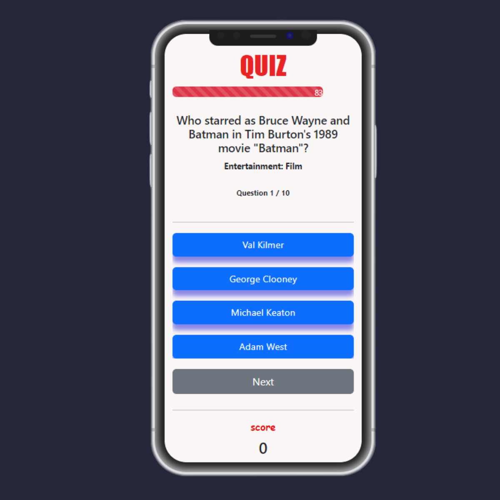

# Quizz App 💭⁉️

This is a simple quiz application developed in HTML, CSS, and JavaScript. It allows users to answer multiple-choice questions and obtain a score at the end of the quiz. The app displays one question at a time and provides visual feedback on the selected answers.

## Used API 🌐

This project utilizes the Open Trivia Database (OpenTDB) API. It provides a wide range of trivia questions and answers in various categories. You can find more information about this API on their official website:

- [Open Trivia Database](https://opentdb.com/api_config.php)

## Preview image 👁

## Deployment 📦

- [DEMO](https://quizz-app-api-iphone.netlify.app/) - Website

## Challenge Description

Users can:

- Answer multiple-choice questions.
- See visual feedback on the selected answers.
- Get a score upon finishing the quiz.
- See a timer showing the remaining time to answer each question.
- Proceed to the next question once an answer is selected.

## Technologies Used 🛠️

- HTML
- CSS
- JavaScript
- Bootstrap

## Acknowledgements 🎁

- [Saepul](https://codepen.io/aepnat) - Appreciation for providing the iphone X mockup user interface code.

## Authors ✒️

- **Lucas Quiroga** - _Initial work_ - [Lucas Quiroga](https://github.com/Lucas-Quiroga)

## License 📄

This project is licensed © LUCAS QUIROGA 2023, all rights reserved.
